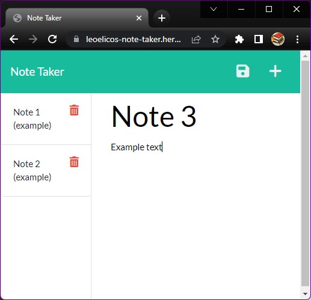

# Note Taker

  

## Introduction

This easy-to-use note-taking application allows the user to write and save notes in order to better arrange and document memos for work or study.

This application uses npm packages `express` and `uuid`, uses Express.js middleware and is deployed with Heroku.

I made this app in order to learn how to use various middleware, such as express.json(), express.urlencoded and express.static, and finally mounted and unmounted middleware with express.use.

## Usage

Deployed: [Note Taker on Heroku](https://leoelicos-note-taker.herokuapp.com/). Will run on a browser.

Source code: [Note Taker on GitHub](https://github.com/leoelicos/bcs-11-note-taker).

| Step               | GUI                                                      |
| ------------------ | -------------------------------------------------------- |
| Start taking notes | click 'Get Started'                                      |
| Make a new note    | Click the `+` icon, enter Note Title, enter Note Text    |
| Save the new note  | Click the 'save' icon (it appears when you start typing) |
| Start a new note   | Click the `+` icon (this will clear any unsaved notes)   |

-  Video demo: https://user-images.githubusercontent.com/99461390/167338663-9d9135c9-c289-48b4-8e2f-59cdf60a40c3.mp4

-  Video demo is also on YouTube: (https://youtu.be/YAFUzEbLw6E)

## Screenshots

### Screenshot: Ready to write

### Screenshot: Writing

## Credits

-  BCS Resources
-  normalize.css v8.0.1 | MIT License | github.com/necolas/normalize.css

## License

&copy; Leo Wong <leoelicos@gmail.com>

Licensed under the [MIT License](./LICENSE).
